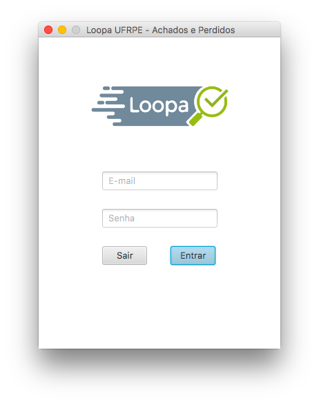
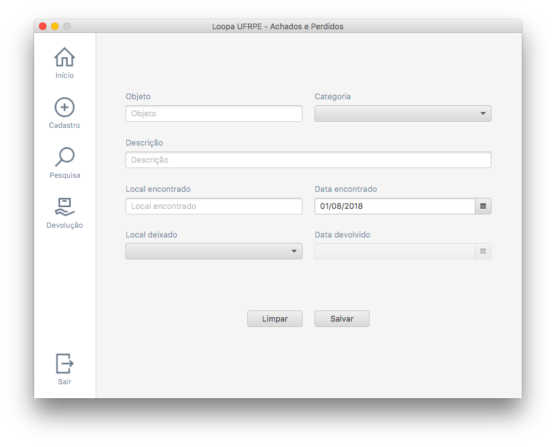
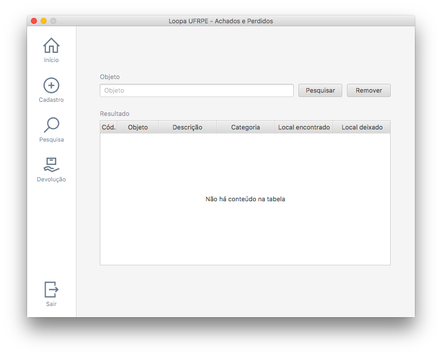
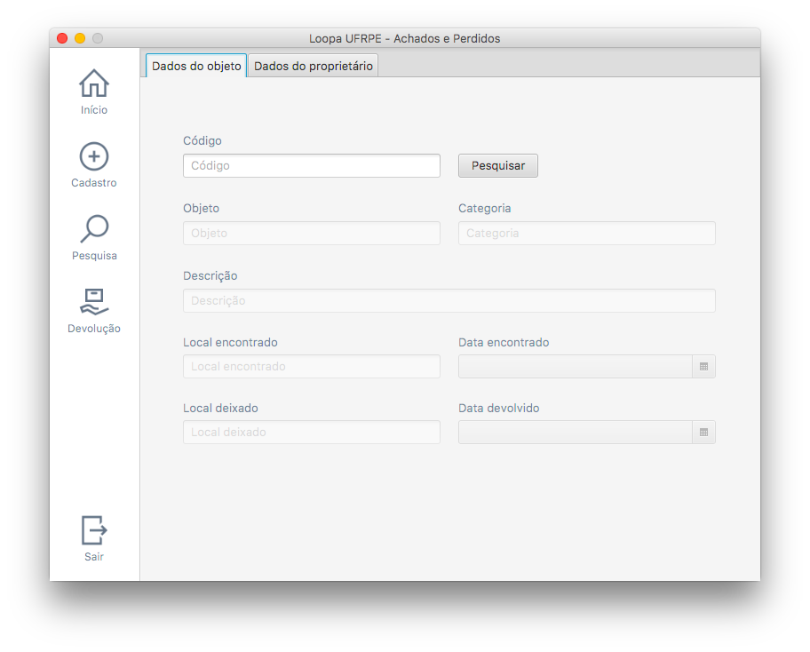
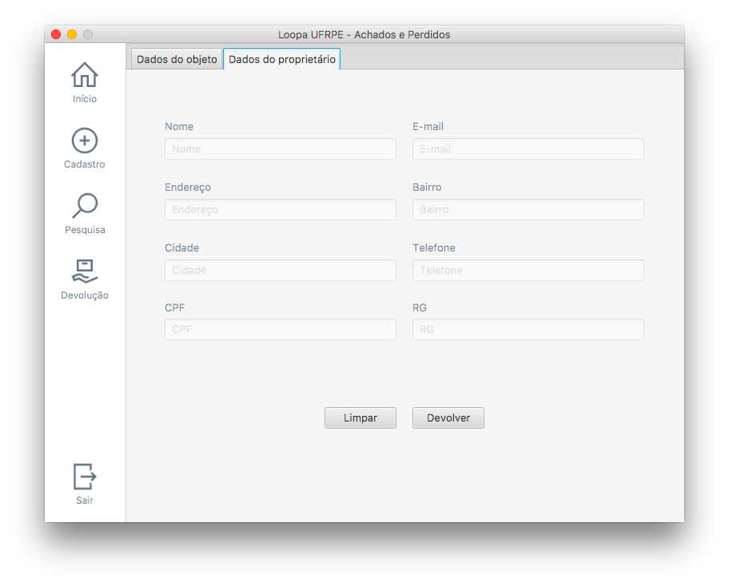

<p align="center">
  
</p>

## Project Description

The project consists of the implementation of a lost and found management system at the Federal Rural University of Pernambuco, which can be used in other educational institutions.

## About the System

Loopa aims to facilitate the registration of lost objects and centralize information in a single database, with free consultations in various sectors of the university (e.g., course coordinations).

## Screens

### Authentication

Each user has unique authentication data previously registered by the system administrator.

<p align="center">
  
</p>

### Start

Summary of all registered, lost (not yet returned) and returned objects.

<p align="center">
  
</p>

### Register

Registration and generation of unique code for later search and identification of objects.

<p align="center">
  
</p>

### Search

Listing of all registered objects or search by specific name.

<p align="center">
  
</p>

### Devolution

Data referring to the object to be returned.

<p align="center">
  
</p>

Data regarding the owner of the object.

<p align="center">
  
</p>

### Execution

Change the `loopa-ufrpe/src/main/resources/META-INF/persistence.xml` file according to the database.

```xml
<?xml version="1.0" encoding="UTF-8"?>

<persistence version="2.1"
  xmlns="http://xmlns.jcp.org/xml/ns/persistence"
  xmlns:xsi="http://www.w3.org/2001/XMLSchema-instance" xsi:schemaLocation="http://xmlns.jcp.org/xml/ns/persistence http://xmlns.jcp.org/xml/ns/persistence/persistence_2_1.xsd">
  <persistence-unit name="loopa_pu" transaction-type="RESOURCE_LOCAL">
    <provider>org.hibernate.jpa.HibernatePersistenceProvider</provider>
    <class>br.ufrpe.loopa.model.bean.Person</class>
    <class>br.ufrpe.loopa.model.bean.Employee</class>
    <class>br.ufrpe.loopa.model.bean.Item</class>
    <properties>
      <property name="javax.persistence.jdbc.url" value="jdbc:postgresql://localhost:5432/DATABASE_NAME"/>
      <property name="javax.persistence.jdbc.user" value="USER"/>
      <property name="javax.persistence.jdbc.driver" value="org.postgresql.Driver"/>
      <property name="javax.persistence.jdbc.password" value="PASSWORD"/>
      <property name="hibernate.cache.provider_class" value="org.hibernate.cache.NoCacheProvider"/>
      <property name="javax.persistence.schema-generation.database.action" value="update"/>
    </properties>
  </persistence-unit>
</persistence>
```
